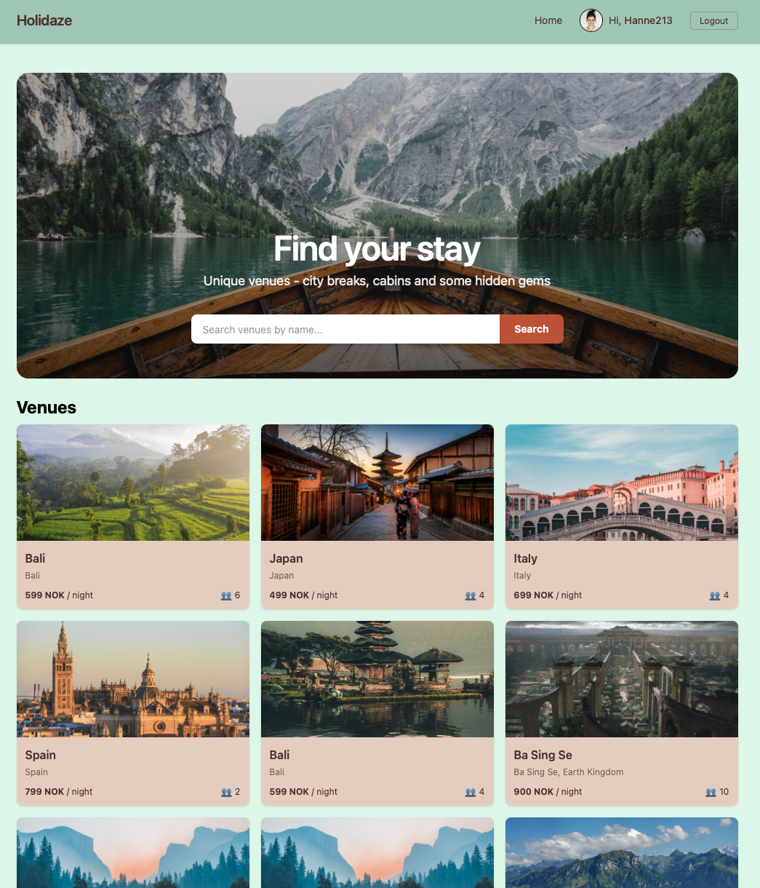

# Holidaze - Booking site (Project Exam 2)

Front-end application for accommodation booking site "Holidaze".
Built as a part of Noroff Front-end Development - Project Exam 2.

The project demonstrates use of React, API communication, routing and responsive design.

## Screenshot



## Description

Holidaze is a booking site where users can browse venues, search venues, view venue details, see availability and create a booking.
There is also an admin-facing experience for venue managers who can create, update and delete venues, as well as view upcoming bookings.

## Built with

- React
- React Router
- Vite
- Tailwind CSS

## Getting started

### Installing

1. Clone the repository:
```bash
git clone https://github.com/HanneStray/holidaze-project
```

2. install dependencies:
```bash
npm install
```

## Environment Variables

This project requires a Noroff API key.

Create a `.env` file in the project root:
```env
VITE_NOROFF_API_KEY=your_key_here
```

Do not commit the .env file to GitHub.

## Running

To run the app locally:
```bash
npm run dev
```

## Build
```bash
npm run build
```

## Code Review & Improvements

Following feedback received on Project Exam 2, the following improvements were made:

### Bug Fixes & Code Quality
- Removed all `console.log` and `console.error` statements across the codebase
- Fixed accessibility issues by adding `htmlFor` and matching `id` attributes to all label/input pairs
- Replaced `let` with `const` for variables that are never reassigned
- Replaced string concatenation with template literals
- Fixed inconsistent return statements in async functions
- Corrected a typo in `Navbar.jsx` where `JusName` was used instead of `className`

### Documentation
- Added JSDoc comments to all functions and components across 19 source files

### Design & UX Improvements
- Applied custom brand color scheme based on original style guide (moss green, sage, terracotta, soft mint)
- Enhanced venue cards to display price per night, location and guest count
- Added hero search bar overlaid on the hero image, replacing the separate search input below
- Added skeleton loaders replacing text "Loading..." for a more polished feel
- Added toast notifications for successful actions (booking, avatar update, venue create/edit/delete)
- Added fade-in animations when venue cards load
- Enhanced footer with navigation links, contact information and social media links

## Contributing

This project is a school exam delivery, not open for contribution

### Contact

Email: hanne_stray@hotmail.com

## Acknowledgments

- Noroff API (Holidaze) documentation
- Hero Image: https://unsplash.com/photos/brown-wooden-boat-moving-towards-the-mountain-O453M2Liufs

## Links Project Delivery

- Gantt chart: https://trello.com/b/HHE2UG8z
- Design prototype: https://www.figma.com/design/OEVaNEt1LMZp3MQ6nZOViC/Holidaze---prototype?node-id=0-1&t=bCGxvzI2YL8HN4HZ-1
- Style guide: https://www.figma.com/deck/fvJl1L0jqotzshJpYD8kXz/Project-Exam---Holidaze?node-id=46-115&t=RH6hEG13z2FBy0V9-1
- Kanban Board: https://trello.com/b/BBOWlxg3
- Repository: https://github.com/HanneStray/holidaze-project
- Hosted demo: https://hanneholidazeproject.netlify.app
